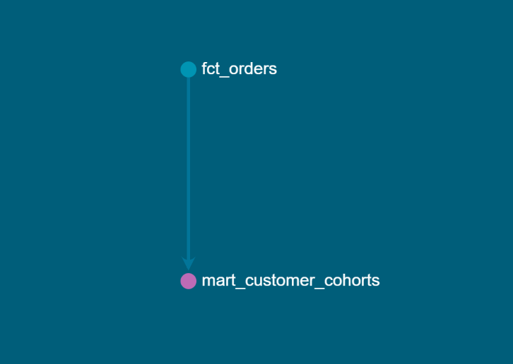

Olist E-Commerce Analytics — End-to-End Data Engineering + BI Project

Hi! This is a project I built to understand how real e-commerce analytics work using the Olist dataset (Brazil’s biggest marketplace dataset).
My goal was simple: load real data → clean it → model it → analyze it → visualize it → find what’s actually going wrong in the business.
This project helped me practice:
Google BigQuery
dbt 
SQL modeling
Power BI dashboards
Thinking like a data analyst, not just someone who plots charts

1. What Problem I Tried to Solve
After exploring the data, two questions stood out to me:

 1. Are customers coming back after their first purchase?
I suspected the marketplace was struggling with retention — basically the “leaky bucket” issue.

 2. Are a few bad sellers ruining the customer experience?
Late deliveries, bad service… even one seller like this can affect reviews.

These two questions shaped the whole project.

2. How I Built the Project (My Process)
I used a simple version of the L-M-T framework (Layers, Mental Models, Tools).
It helped me keep things clean and structured even as a fresher.

Layer 1 — Staging (stg_*)
I loaded all raw CSVs into BigQuery and did only basic cleaning:
renaming
type conversions
fixing inconsistencies
Nothing fancy — just good clean base tables.

Layer 2 — Intermediate (fct_*)
I built a fact table where each row represents one order item.
It brings together:
orders
customers
items
payments
delivery dates
This made analysis MUCH easier later.

Layer 3 — Marts (mart_*)
These are small, specific tables for analysis and dashboarding.
Examples:
Seller performance
Monthly revenue
RFM segmentation
Delivery analysis
Everything loads fast in Power BI because of these marts.

3. Tech Stack I Used
BigQuery → data warehouse
dbt → transformations + lineage
Power BI → dashboards
Sublime Text → writing SQL and docs

4. What I Found (My Key Observations)
 1. NO Customer Retention 
In the next month after a customer’s first purchase, there are no return.
This shocked me.
Basically the marketplace is running on new customer acquisition.
 2. Delivery Delays Affect Reviews Directly
Sellers who deliver late get poor ratings consistently.
This pattern is very clear.
 3. A Small Group of Customers Are Extremely Valuable
Looked For Customers Who Provided Value Through RFM analysis
But There Was No Customer Found Who Provided Value Particularly.

5. What I Would Recommend 
 1 Retention-focused campaigns
Even a simple follow-up email or discount could help bring customers back.
 2. Shipping SLA rules
Sellers who delay orders repeatedly should be flagged or penalized.
 3. Basic loyalty program
Because the high-value customers are worth keeping.
These are simple but practical steps.

6. Project Visuals
lineage_graph_mart_customer_cohorts-

7. What I Learned from This Project
How to structure a real data pipeline
How important model layers are
How delivery logistics affects customer experience
How RFM and cohort analysis work
How to convert SQL tables into business insights
For me, this project was the closest thing to working like a real data analyst.

8. Final Workflow (Simple Version)
Load raw CSVs → BigQuery
Create staging models
Build fct_orders
Create marts
Analyze retention, sellers, RFM
Build Power BI dashboard
Document everything
